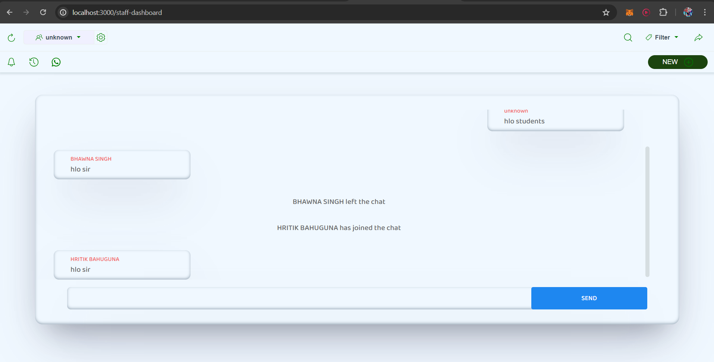

# Chat Room Application for College Students and Staff

Welcome to the comprehensive documentation for our Chat Room application designed specifically for college students and staff (professors). This documentation provides detailed information about the application's features, architecture, setup instructions, and more.

## Overview

Our Chat Room application offers a platform for students and staff members to engage in real-time communication within the college community. It provides a secure and user-friendly environment for exchanging messages, facilitating collaboration, and fostering a sense of community among students and staff.

## Features

### Secure Authentication

- **Student Login**: Students can log in using their Student ID or University Roll Number.
- **Staff Login**: Staff members (professors) can log in using their names.
- **Google OAuth2 Authentication**: Google authentication is utilized for secure login using Gmail credentials.

### Anonymous Staff Chat

- Staff members' identities remain anonymous in the chat.
- Only students' names are displayed with their messages, ensuring privacy for staff members.

### Simple Setup

- Setting up the project is straightforward and requires minimal configuration.
- Detailed setup instructions are provided in the "Getting Started" section below.

### Basic Chat Functionality

- Users can engage in real-time text-based chat with other users.
- Media sharing is not supported; the application focuses solely on text-based communication.

## Screenshots

### Home Screen


The home screen serves as the entry point for users, where they can log in or create a new account. Students can log in using their Student ID or University Roll Number, while staff members can log in using their names. Google OAuth2 authentication is used for secure login.

### Dashboard




The dashboard is the main interface for users after logging in. Here, students and staff members can engage in real-time chat with each other. Staff members' identities remain anonymous in the chat, while students' names are displayed with their messages.

## Technologies Used

### Backend

- **Framework**: Express.js
- **Database**: MongoDB
- **Database Interaction**: Mongoose
- **Authentication**: Google OAuth2

### Frontend

- **UI Framework**: UIkit
- **Template Engine**: Express-handlebars

### Additional Libraries

- **Cookie and Session Management**: Cookie-parser or express-session
- **Real-time Communication**: Socket.io

## Schemas

### Student Schema

```javascript
{
  _id: ObjectId,
  registration_status: Boolean,
  student_id: String,
  email: String,
  university_roll_no: String,
  class_roll_no: Number,
  student_name: String,
  father_name: String,
  section: String,
  year_sem: Number,
  branch: String
}
```

- **_id**: Unique identifier for the student record.
- **registration_status**: Boolean indicating whether the student is registered.
- **student_id**: Student's ID.
- **email**: Student's email address (initially empty, updated after login).
- **university_roll_no**: Student's university roll number.
- **class_roll_no**: Student's class roll number.
- **student_name**: Student's name.
- **father_name**: Student's father's name.
- **section**: Student's section.
- **year_sem**: Student's year/semester.
- **branch**: Student's branch of study.

### Staff Schema

```javascript
{
  _id: ObjectId,
  name: String,
  email: String
}
```

- **_id**: Unique identifier for the staff record.
- **name**: Staff member's name.
- **email**: Staff member's email address (initially empty, updated after login).

These schemas outline the structure of the student and staff documents stored in the MongoDB database. Each document contains specific fields related to the user's information, facilitating authentication, and personalized chat experiences.

### Account Creation Request

If a student is not found in the database, they can submit a request for account creation. Staff members will review these requests and then provide the student with the necessary credentials to log in to the system. This process ensures that only authorized students and staff members have access to the chat room application.

## Getting Started

To set up the project locally, follow these steps:

1. Clone the repository to your local machine.
2. Replace the existing Google credentials file in the `/credentials` folder with your own Google credentials file.
3. Install project dependencies by running `npm install`.
4. Start the application by running `npm run dev`.
5. Access the application in your web browser at the specified address (usually `http://localhost:3000`).

## Note

This project was developed as a learning experience and is not associated with any tutorial or course. It was built with the intention of providing a practical application for college students and staff members to facilitate communication within the college community.

